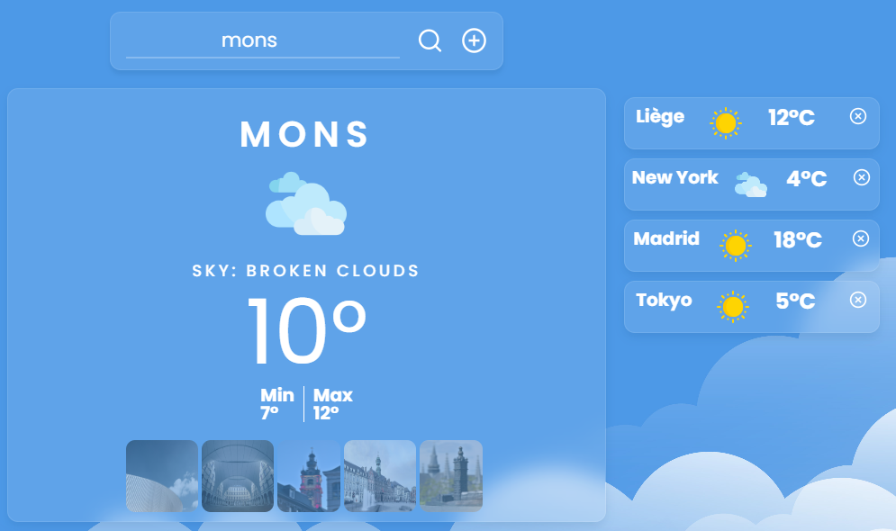

# Weather App

Weather App is a weather application that allows you to search for and display forecasts for one or multiple cities for the next 5 days.

## Technologies

This application was built using HTML, CSS, SCSS, JavaScript, OpenWeather API, Unsplash API, and Chart.js.

## Features

- **City Search with Autocomplete**
- **Show a panel of photos of the city**
- **Visualization of this week temperatures and next hours**
- **Local Storage with JSON, memorize last search**
- **Responsive design**
- **Graph Displaying Temperatures of Selected City**

- **Comparison of Weather Data for Multiple Cities:**

## Work in progress

- Responsive
- Graphs
